Examining Affairs: an Exploratory Data Analysis Project
================

This is an examination of Infidelity data, known as Fair’s Affairs: a
cross-section dataset from a survey conducted by Psychology Today in
1969.

An initial look: how are affairs distributed? Does gender play a role?

``` r
Affairs %>% 
  ggplot(aes(affairs))+
  geom_bar(aes(fill = gender))+
  scale_fill_manual(values=wes_palette(n=2, name = "GrandBudapest2"))
```

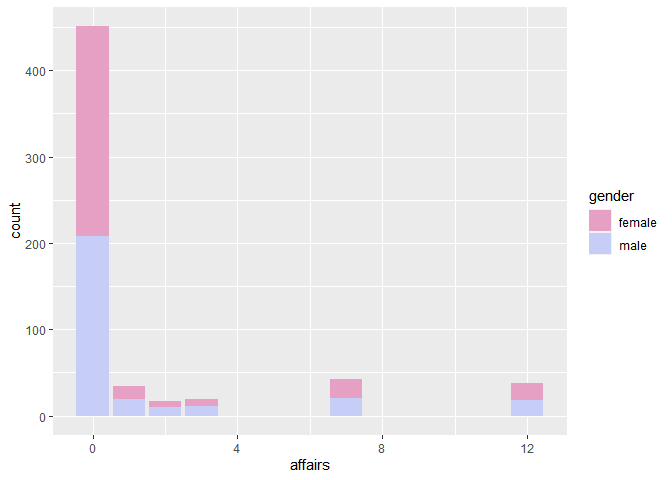<!-- -->

Let’s introduce a new variable, faithful, for people who have never had
an affair. A binary variation of the variable, faithful\_num, will be
useful for visualising proportions.

``` r
Affairs <- Affairs %>% 
  mutate(
    faithful = factor(ifelse(Affairs$affairs == 0, "Yes", "No"), levels = c("No", "Yes")),
    faithful_num = ifelse(Affairs$affairs == 0, 1, 0)
  ) 
```

## Comparing the proportion of faithful indviduals by gender:

``` r
Affairs%>%
  group_by(gender) %>% 
  summarise(faithful_prop = mean(faithful_num)) %>% 
  ggplot(aes(gender, faithful_prop, fill = gender))+
  geom_col()+
  scale_fill_manual(values=wes_palette(n=2, name="GrandBudapest2"))+
  ylab("Proportion of faithful individuals")
```

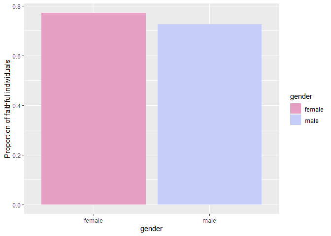<!-- -->

Women appear to have a slightly higher proportion of faithfulness than
men.

``` r
tab_model(lm(faithful_num ~ gender, data = Affairs), p.style = "stars")
```

<table style="border-collapse:collapse; border:none;">

<tr>

<th style="border-top: double; text-align:center; font-style:normal; font-weight:bold; padding:0.2cm;  text-align:left; ">

 

</th>

<th colspan="2" style="border-top: double; text-align:center; font-style:normal; font-weight:bold; padding:0.2cm; ">

faithful\_num

</th>

</tr>

<tr>

<td style=" text-align:center; border-bottom:1px solid; font-style:italic; font-weight:normal;  text-align:left; ">

Predictors

</td>

<td style=" text-align:center; border-bottom:1px solid; font-style:italic; font-weight:normal;  ">

Estimates

</td>

<td style=" text-align:center; border-bottom:1px solid; font-style:italic; font-weight:normal;  ">

CI

</td>

</tr>

<tr>

<td style=" padding:0.2cm; text-align:left; vertical-align:top; text-align:left; ">

(Intercept)

</td>

<td style=" padding:0.2cm; text-align:left; vertical-align:top; text-align:center;  ">

0.77 <sup>\*\*\*</sup>

</td>

<td style=" padding:0.2cm; text-align:left; vertical-align:top; text-align:center;  ">

0.72 – 0.82

</td>

</tr>

<tr>

<td style=" padding:0.2cm; text-align:left; vertical-align:top; text-align:left; ">

gender \[male\]

</td>

<td style=" padding:0.2cm; text-align:left; vertical-align:top; text-align:center;  ">

\-0.04 <sup></sup>

</td>

<td style=" padding:0.2cm; text-align:left; vertical-align:top; text-align:center;  ">

\-0.11 – 0.03

</td>

</tr>

<tr>

<td style=" padding:0.2cm; text-align:left; vertical-align:top; text-align:left; padding-top:0.1cm; padding-bottom:0.1cm; border-top:1px solid;">

Observations

</td>

<td style=" padding:0.2cm; text-align:left; vertical-align:top; padding-top:0.1cm; padding-bottom:0.1cm; text-align:left; border-top:1px solid;" colspan="2">

601

</td>

</tr>

<tr>

<td style=" padding:0.2cm; text-align:left; vertical-align:top; text-align:left; padding-top:0.1cm; padding-bottom:0.1cm;">

R<sup>2</sup> / R<sup>2</sup> adjusted

</td>

<td style=" padding:0.2cm; text-align:left; vertical-align:top; padding-top:0.1cm; padding-bottom:0.1cm; text-align:left;" colspan="2">

0.003 / 0.001

</td>

</tr>

<tr>

<td colspan="3" style="font-style:italic; border-top:double black; text-align:right;">

  - p\<0.05   \*\* p\<0.01   \*\*\* p\<0.001
    </td>
    </tr>

</table>

However, if we regress faithfulness against only gender, the
significance appears very low. Also, the R-squared and adjusted R-
squared are both very small.

## What is the overall count of faithful vs non-faithful individuals?

``` r
table(Affairs$faithful)
```

    ## 
    ##  No Yes 
    ## 150 451

What is that proportionatelly?

``` r
faithful_perc <- paste(round(100*mean(Affairs$faithful_num),2), "%")
(faithful_perc)
```

    ## [1] "75.04 %"

Okay, so we still have some faith in humanity left.

## Does having children impact faithfulness?

Let’s peek at the overall distribution.

``` r
Affairs %>% 
  ggplot(aes(children, affairs))+
  geom_count(aes(color = children))+
  scale_color_manual(values = wes_palette(n=2, name = "GrandBudapest2"))
```

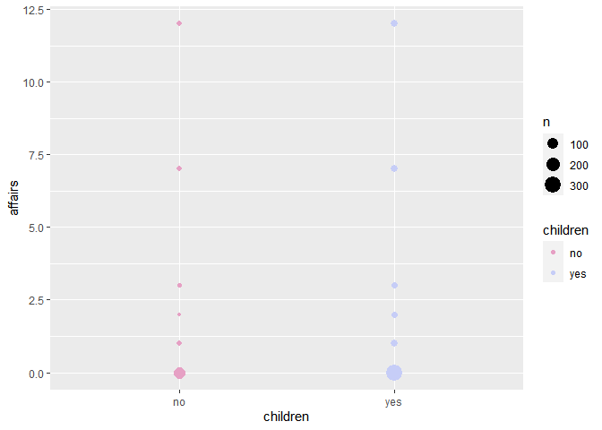<!-- -->

A bar chart:

``` r
Affairs%>% 
  ggplot(aes(children, fill = faithful))+
  geom_bar()+
  scale_fill_manual(values=wes_palette(n=2, name="GrandBudapest2"))
```

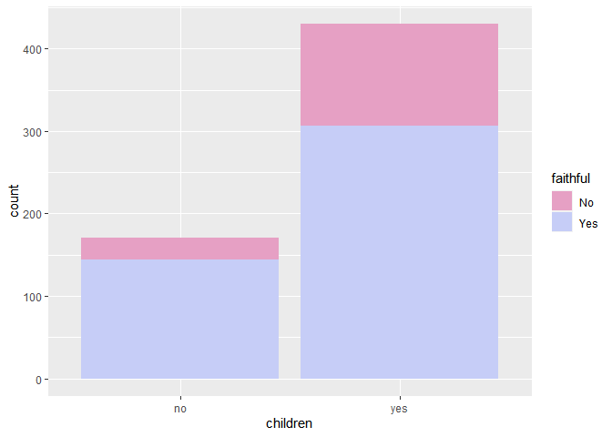<!-- -->

How does faithfulness look proportionatelly?

``` r
Affairs %>% 
  group_by(children) %>% 
  summarise(faith_prop = mean(faithful_num))
```

    ## # A tibble: 2 x 2
    ##   children faith_prop
    ##   <fct>         <dbl>
    ## 1 no            0.842
    ## 2 yes           0.714

A graph with proportions:

``` r
Affairs %>% 
  group_by(children) %>% 
  summarise(faith_prop = mean(faithful_num)) %>% 
  ggplot(aes(children, faith_prop, fill = children))+
  geom_col()+
  scale_fill_manual(values = wes_palette(n=2, name = "GrandBudapest2"))+
  ylab("Proportion of faithful individuals")
```

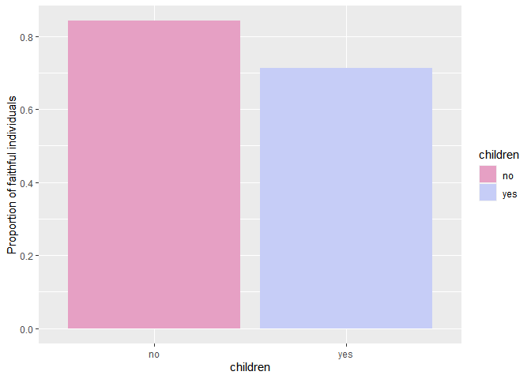<!-- -->

So, people without children appear to have less affairs.

## Are unhappy couples more likely to be unfaithful?

Let’s make life easier for ourselves by updating “rating” and
“religiousness” to factors.

``` r
Affairs <- Affairs %>% 
  mutate(
    rating =  factor(rating, levels = c("1", "2", "3", "4", "5")),
    religiousness =  factor(religiousness, levels = c("1", "2", "3", "4", "5"))
  )
```

Now a simple look at the overall distribution:

``` r
Affairs %>% 
  ggplot(aes(rating, affairs))+
  geom_col(aes(fill = rating))+
  scale_fill_manual(values = wes_palette(n = 5, name = "Moonrise3"))+
  xlab("Happiness rating")
```

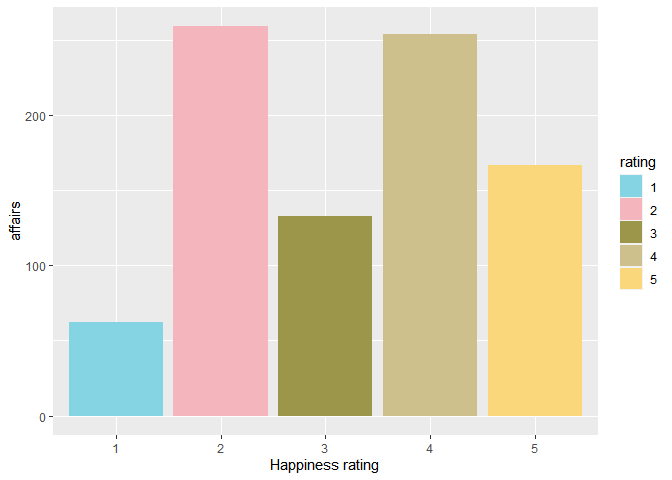<!-- -->

Weird, could unhappy couples really be less prone to affairs than very
happy ones? Let’s look at faithfulness proportions instead.

``` r
Affairs %>% 
  group_by(rating) %>% 
  summarise(faith_prop = mean(faithful_num)) %>% 
  ggplot(aes(rating, faith_prop))+
  geom_col(aes(fill = rating))+
  scale_fill_manual(values = wes_palette(n = 5, name = "GrandBudapest2", type = "continuous"))+
  xlab("Happiness rating")+
   ylab("Proportion of faithful individuals")
```

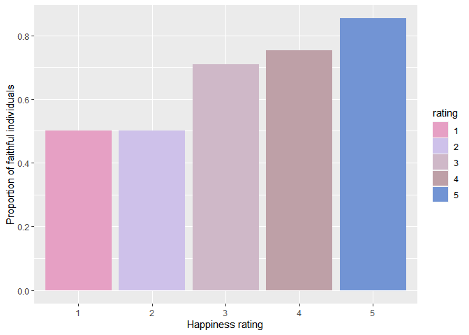<!-- -->

Okay, so when we look at faithfulness proportionatelly, it matches the
common sense assumption that happier couples will be less prone to
cheating.

## What about religiousness, does it have an impact?

An initial look:

``` r
Affairs %>% 
  ggplot(aes(religiousness, affairs))+
  geom_col(aes(fill = religiousness))+
  scale_fill_manual(values = wes_palette(n = 5, name = "Rushmore1", type = "continuous"))
```

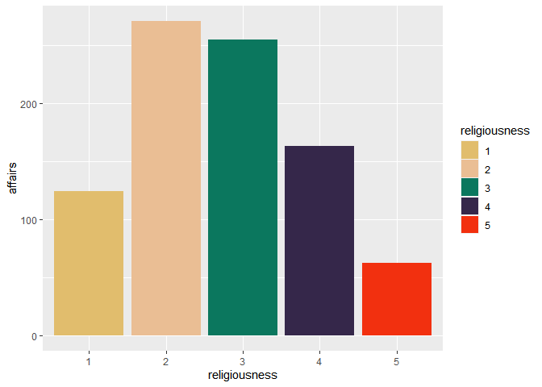<!-- -->

Faithfulness proportionatelly:

``` r
Affairs %>% 
  group_by(religiousness) %>%
  summarise(faith_prop = mean(faithful_num)) %>% 
  ggplot()+
  geom_col(aes(religiousness,faith_prop, fill = religiousness))+
  scale_fill_manual(values = wes_palette(n = 5, name = "Rushmore1", type = "continuous"))+
  ylab("Proportion of faithful individuals")
```

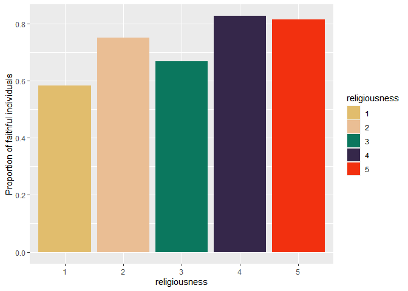<!-- -->

Anti-religous people seem to have a lower proportion of faithfulness
than others.

## Is there a link between religiousness and having children?

Let’s make a binary variable for having children.

``` r
Affairs %>% 
  mutate(
    children_bin = ifelse(children == "yes", 1, 0)
  ) %>% 
  group_by(religiousness) %>% 
  summarise(child_proportion = mean(children_bin))
```

    ## # A tibble: 5 x 2
    ##   religiousness child_proportion
    ##   <fct>                    <dbl>
    ## 1 1                        0.646
    ## 2 2                        0.634
    ## 3 3                        0.729
    ## 4 4                        0.763
    ## 5 5                        0.8

A graph:

``` r
Affairs %>% 
  mutate(
    children_bin = ifelse(children == "yes", 1, 0)
  ) %>% 
  group_by(religiousness) %>% 
  summarise(child_proportion = mean(children_bin)) %>% 
  ggplot(aes(religiousness, child_proportion))+
  geom_col(aes(fill = religiousness))+
  scale_fill_manual(values = wes_palette(n = 5, name = "Rushmore1", type = "continuous"))+
  ylab("Proportion of individuals with children")
```

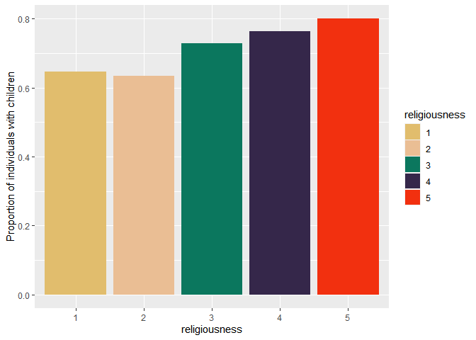<!-- -->

There appears to be a link.

## What about education and faithfulness?

Let’s create a new facor with names and concatenate “some college” with
“high school graduate” and “some graduate work” with “college
graduate”, as these two levels seem arbitrary.

``` r
Affairs <- Affairs %>% 
  mutate(
    education_ft = factor(education, levels = c("9", "12", "14", "16", "17", "18", "20")),
    education_ft = fct_recode(education_ft,
                              "grade_school" = "9",
                              "high_school" = "12",
                              "high_school" = "14",
                              "college" = "16",
                              "college" = "17",
                              "masters" = "18",
                              "phd_or_similar" = "20"
    )
  )
```

Looking into faithfulness proportions again.

``` r
Affairs %>% 
  group_by(education_ft) %>% 
  summarise(faithful_prop = mean(faithful_num)) %>% 
  ggplot(aes(education_ft, faithful_prop))+
  geom_col(aes(fill = education_ft))+
  scale_fill_manual(values = wes_palette(n = 5, name = "GrandBudapest1", type = "continuous"))+
  ylab("Proportion of faithful individuals")
```

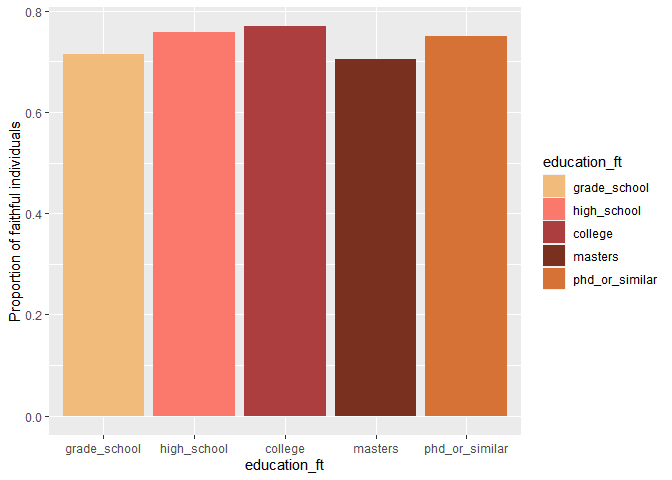<!-- -->

There doesn’t appear to be a clear connection.

## What about occupation?

``` r
Affairs %>% 
  mutate(occupation = factor(occupation, levels = 1:7)) %>% 
  group_by(occupation) %>% 
  summarise(faithful_prop = mean(faithful_num))%>% 
  ggplot(aes(occupation, faithful_prop))+
  geom_col(aes(fill = occupation))+
  scale_fill_manual(values = wes_palette(n = 7, name = "Royal2", type = "continuous"))+
  ylab("Proportion of faithful individuals")
```

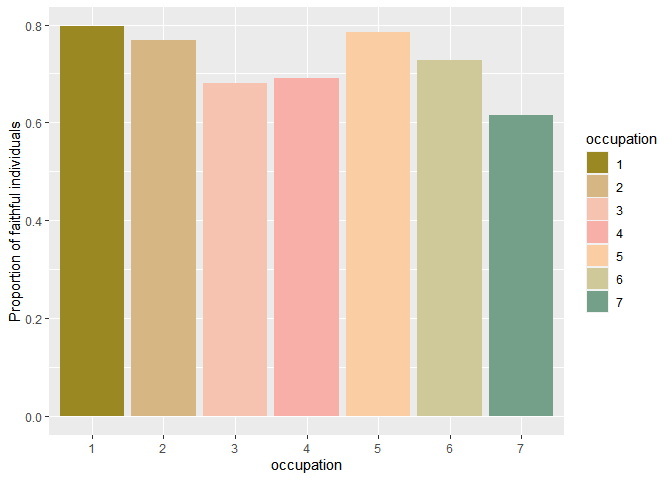<!-- -->

Again, no clear connection.

## Linear regressions

``` r
lm1 <- lm(affairs ~ gender + children + religiousness + rating + yearsmarried + age , data = Affairs)
tab_model(lm1, p.style = "stars")
```

<table style="border-collapse:collapse; border:none;">

<tr>

<th style="border-top: double; text-align:center; font-style:normal; font-weight:bold; padding:0.2cm;  text-align:left; ">

 

</th>

<th colspan="2" style="border-top: double; text-align:center; font-style:normal; font-weight:bold; padding:0.2cm; ">

affairs

</th>

</tr>

<tr>

<td style=" text-align:center; border-bottom:1px solid; font-style:italic; font-weight:normal;  text-align:left; ">

Predictors

</td>

<td style=" text-align:center; border-bottom:1px solid; font-style:italic; font-weight:normal;  ">

Estimates

</td>

<td style=" text-align:center; border-bottom:1px solid; font-style:italic; font-weight:normal;  ">

CI

</td>

</tr>

<tr>

<td style=" padding:0.2cm; text-align:left; vertical-align:top; text-align:left; ">

(Intercept)

</td>

<td style=" padding:0.2cm; text-align:left; vertical-align:top; text-align:center;  ">

5.02 <sup>\*\*\*</sup>

</td>

<td style=" padding:0.2cm; text-align:left; vertical-align:top; text-align:center;  ">

2.97 – 7.07

</td>

</tr>

<tr>

<td style=" padding:0.2cm; text-align:left; vertical-align:top; text-align:left; ">

gender \[male\]

</td>

<td style=" padding:0.2cm; text-align:left; vertical-align:top; text-align:center;  ">

0.25 <sup></sup>

</td>

<td style=" padding:0.2cm; text-align:left; vertical-align:top; text-align:center;  ">

\-0.27 – 0.76

</td>

</tr>

<tr>

<td style=" padding:0.2cm; text-align:left; vertical-align:top; text-align:left; ">

children \[yes\]

</td>

<td style=" padding:0.2cm; text-align:left; vertical-align:top; text-align:center;  ">

\-0.27 <sup></sup>

</td>

<td style=" padding:0.2cm; text-align:left; vertical-align:top; text-align:center;  ">

\-0.94 – 0.41

</td>

</tr>

<tr>

<td style=" padding:0.2cm; text-align:left; vertical-align:top; text-align:left; ">

religiousness \[2\]

</td>

<td style=" padding:0.2cm; text-align:left; vertical-align:top; text-align:center;  ">

\-1.12 <sup>\*</sup>

</td>

<td style=" padding:0.2cm; text-align:left; vertical-align:top; text-align:center;  ">

\-2.11 – -0.13

</td>

</tr>

<tr>

<td style=" padding:0.2cm; text-align:left; vertical-align:top; text-align:left; ">

religiousness \[3\]

</td>

<td style=" padding:0.2cm; text-align:left; vertical-align:top; text-align:center;  ">

\-0.89 <sup></sup>

</td>

<td style=" padding:0.2cm; text-align:left; vertical-align:top; text-align:center;  ">

\-1.92 – 0.13

</td>

</tr>

<tr>

<td style=" padding:0.2cm; text-align:left; vertical-align:top; text-align:left; ">

religiousness \[4\]

</td>

<td style=" padding:0.2cm; text-align:left; vertical-align:top; text-align:center;  ">

\-2.02 <sup>\*\*\*</sup>

</td>

<td style=" padding:0.2cm; text-align:left; vertical-align:top; text-align:center;  ">

\-3.00 – -1.04

</td>

</tr>

<tr>

<td style=" padding:0.2cm; text-align:left; vertical-align:top; text-align:left; ">

religiousness \[5\]

</td>

<td style=" padding:0.2cm; text-align:left; vertical-align:top; text-align:center;  ">

\-2.02 <sup>\*\*\*</sup>

</td>

<td style=" padding:0.2cm; text-align:left; vertical-align:top; text-align:center;  ">

\-3.16 – -0.87

</td>

</tr>

<tr>

<td style=" padding:0.2cm; text-align:left; vertical-align:top; text-align:left; ">

rating \[2\]

</td>

<td style=" padding:0.2cm; text-align:left; vertical-align:top; text-align:center;  ">

0.32 <sup></sup>

</td>

<td style=" padding:0.2cm; text-align:left; vertical-align:top; text-align:center;  ">

\-1.37 – 2.00

</td>

</tr>

<tr>

<td style=" padding:0.2cm; text-align:left; vertical-align:top; text-align:left; ">

rating \[3\]

</td>

<td style=" padding:0.2cm; text-align:left; vertical-align:top; text-align:center;  ">

\-2.02 <sup>\*</sup>

</td>

<td style=" padding:0.2cm; text-align:left; vertical-align:top; text-align:center;  ">

\-3.67 – -0.38

</td>

</tr>

<tr>

<td style=" padding:0.2cm; text-align:left; vertical-align:top; text-align:left; ">

rating \[4\]

</td>

<td style=" padding:0.2cm; text-align:left; vertical-align:top; text-align:center;  ">

\-2.19 <sup>\*\*</sup>

</td>

<td style=" padding:0.2cm; text-align:left; vertical-align:top; text-align:center;  ">

\-3.77 – -0.61

</td>

</tr>

<tr>

<td style=" padding:0.2cm; text-align:left; vertical-align:top; text-align:left; ">

rating \[5\]

</td>

<td style=" padding:0.2cm; text-align:left; vertical-align:top; text-align:center;  ">

\-2.54 <sup>\*\*</sup>

</td>

<td style=" padding:0.2cm; text-align:left; vertical-align:top; text-align:center;  ">

\-4.12 – -0.95

</td>

</tr>

<tr>

<td style=" padding:0.2cm; text-align:left; vertical-align:top; text-align:left; ">

yearsmarried

</td>

<td style=" padding:0.2cm; text-align:left; vertical-align:top; text-align:center;  ">

0.17 <sup>\*\*\*</sup>

</td>

<td style=" padding:0.2cm; text-align:left; vertical-align:top; text-align:center;  ">

0.09 – 0.25

</td>

</tr>

<tr>

<td style=" padding:0.2cm; text-align:left; vertical-align:top; text-align:left; ">

age

</td>

<td style=" padding:0.2cm; text-align:left; vertical-align:top; text-align:center;  ">

\-0.05 <sup>\*</sup>

</td>

<td style=" padding:0.2cm; text-align:left; vertical-align:top; text-align:center;  ">

\-0.09 – -0.00

</td>

</tr>

<tr>

<td style=" padding:0.2cm; text-align:left; vertical-align:top; text-align:left; padding-top:0.1cm; padding-bottom:0.1cm; border-top:1px solid;">

Observations

</td>

<td style=" padding:0.2cm; text-align:left; vertical-align:top; padding-top:0.1cm; padding-bottom:0.1cm; text-align:left; border-top:1px solid;" colspan="2">

601

</td>

</tr>

<tr>

<td style=" padding:0.2cm; text-align:left; vertical-align:top; text-align:left; padding-top:0.1cm; padding-bottom:0.1cm;">

R<sup>2</sup> / R<sup>2</sup> adjusted

</td>

<td style=" padding:0.2cm; text-align:left; vertical-align:top; padding-top:0.1cm; padding-bottom:0.1cm; text-align:left;" colspan="2">

0.156 / 0.139

</td>

</tr>

<tr>

<td colspan="3" style="font-style:italic; border-top:double black; text-align:right;">

  - p\<0.05   \*\* p\<0.01   \*\*\* p\<0.001
    </td>
    </tr>

</table>

Does including education change anything?

``` r
lm2 <- lm(affairs ~ gender + children + religiousness + rating + yearsmarried + age + education, data = Affairs)
tab_model(lm2, p.style = "stars")
```

<table style="border-collapse:collapse; border:none;">

<tr>

<th style="border-top: double; text-align:center; font-style:normal; font-weight:bold; padding:0.2cm;  text-align:left; ">

 

</th>

<th colspan="2" style="border-top: double; text-align:center; font-style:normal; font-weight:bold; padding:0.2cm; ">

affairs

</th>

</tr>

<tr>

<td style=" text-align:center; border-bottom:1px solid; font-style:italic; font-weight:normal;  text-align:left; ">

Predictors

</td>

<td style=" text-align:center; border-bottom:1px solid; font-style:italic; font-weight:normal;  ">

Estimates

</td>

<td style=" text-align:center; border-bottom:1px solid; font-style:italic; font-weight:normal;  ">

CI

</td>

</tr>

<tr>

<td style=" padding:0.2cm; text-align:left; vertical-align:top; text-align:left; ">

(Intercept)

</td>

<td style=" padding:0.2cm; text-align:left; vertical-align:top; text-align:center;  ">

4.79 <sup>\*\*\*</sup>

</td>

<td style=" padding:0.2cm; text-align:left; vertical-align:top; text-align:center;  ">

2.25 – 7.32

</td>

</tr>

<tr>

<td style=" padding:0.2cm; text-align:left; vertical-align:top; text-align:left; ">

gender \[male\]

</td>

<td style=" padding:0.2cm; text-align:left; vertical-align:top; text-align:center;  ">

0.21 <sup></sup>

</td>

<td style=" padding:0.2cm; text-align:left; vertical-align:top; text-align:center;  ">

\-0.34 – 0.77

</td>

</tr>

<tr>

<td style=" padding:0.2cm; text-align:left; vertical-align:top; text-align:left; ">

children \[yes\]

</td>

<td style=" padding:0.2cm; text-align:left; vertical-align:top; text-align:center;  ">

\-0.26 <sup></sup>

</td>

<td style=" padding:0.2cm; text-align:left; vertical-align:top; text-align:center;  ">

\-0.93 – 0.41

</td>

</tr>

<tr>

<td style=" padding:0.2cm; text-align:left; vertical-align:top; text-align:left; ">

religiousness \[2\]

</td>

<td style=" padding:0.2cm; text-align:left; vertical-align:top; text-align:center;  ">

\-1.12 <sup>\*</sup>

</td>

<td style=" padding:0.2cm; text-align:left; vertical-align:top; text-align:center;  ">

\-2.12 – -0.13

</td>

</tr>

<tr>

<td style=" padding:0.2cm; text-align:left; vertical-align:top; text-align:left; ">

religiousness \[3\]

</td>

<td style=" padding:0.2cm; text-align:left; vertical-align:top; text-align:center;  ">

\-0.89 <sup></sup>

</td>

<td style=" padding:0.2cm; text-align:left; vertical-align:top; text-align:center;  ">

\-1.92 – 0.13

</td>

</tr>

<tr>

<td style=" padding:0.2cm; text-align:left; vertical-align:top; text-align:left; ">

religiousness \[4\]

</td>

<td style=" padding:0.2cm; text-align:left; vertical-align:top; text-align:center;  ">

\-2.01 <sup>\*\*\*</sup>

</td>

<td style=" padding:0.2cm; text-align:left; vertical-align:top; text-align:center;  ">

\-2.99 – -1.03

</td>

</tr>

<tr>

<td style=" padding:0.2cm; text-align:left; vertical-align:top; text-align:left; ">

religiousness \[5\]

</td>

<td style=" padding:0.2cm; text-align:left; vertical-align:top; text-align:center;  ">

\-2.02 <sup>\*\*\*</sup>

</td>

<td style=" padding:0.2cm; text-align:left; vertical-align:top; text-align:center;  ">

\-3.16 – -0.87

</td>

</tr>

<tr>

<td style=" padding:0.2cm; text-align:left; vertical-align:top; text-align:left; ">

rating \[2\]

</td>

<td style=" padding:0.2cm; text-align:left; vertical-align:top; text-align:center;  ">

0.29 <sup></sup>

</td>

<td style=" padding:0.2cm; text-align:left; vertical-align:top; text-align:center;  ">

\-1.40 – 1.99

</td>

</tr>

<tr>

<td style=" padding:0.2cm; text-align:left; vertical-align:top; text-align:left; ">

rating \[3\]

</td>

<td style=" padding:0.2cm; text-align:left; vertical-align:top; text-align:center;  ">

\-2.05 <sup>\*</sup>

</td>

<td style=" padding:0.2cm; text-align:left; vertical-align:top; text-align:center;  ">

\-3.70 – -0.40

</td>

</tr>

<tr>

<td style=" padding:0.2cm; text-align:left; vertical-align:top; text-align:left; ">

rating \[4\]

</td>

<td style=" padding:0.2cm; text-align:left; vertical-align:top; text-align:center;  ">

\-2.23 <sup>\*\*</sup>

</td>

<td style=" padding:0.2cm; text-align:left; vertical-align:top; text-align:center;  ">

\-3.82 – -0.63

</td>

</tr>

<tr>

<td style=" padding:0.2cm; text-align:left; vertical-align:top; text-align:left; ">

rating \[5\]

</td>

<td style=" padding:0.2cm; text-align:left; vertical-align:top; text-align:center;  ">

\-2.57 <sup>\*\*</sup>

</td>

<td style=" padding:0.2cm; text-align:left; vertical-align:top; text-align:center;  ">

\-4.17 – -0.97

</td>

</tr>

<tr>

<td style=" padding:0.2cm; text-align:left; vertical-align:top; text-align:left; ">

yearsmarried

</td>

<td style=" padding:0.2cm; text-align:left; vertical-align:top; text-align:center;  ">

0.17 <sup>\*\*\*</sup>

</td>

<td style=" padding:0.2cm; text-align:left; vertical-align:top; text-align:center;  ">

0.09 – 0.25

</td>

</tr>

<tr>

<td style=" padding:0.2cm; text-align:left; vertical-align:top; text-align:left; ">

age

</td>

<td style=" padding:0.2cm; text-align:left; vertical-align:top; text-align:center;  ">

\-0.05 <sup>\*</sup>

</td>

<td style=" padding:0.2cm; text-align:left; vertical-align:top; text-align:center;  ">

\-0.09 – -0.00

</td>

</tr>

<tr>

<td style=" padding:0.2cm; text-align:left; vertical-align:top; text-align:left; ">

education

</td>

<td style=" padding:0.2cm; text-align:left; vertical-align:top; text-align:center;  ">

0.02 <sup></sup>

</td>

<td style=" padding:0.2cm; text-align:left; vertical-align:top; text-align:center;  ">

\-0.10 – 0.13

</td>

</tr>

<tr>

<td style=" padding:0.2cm; text-align:left; vertical-align:top; text-align:left; padding-top:0.1cm; padding-bottom:0.1cm; border-top:1px solid;">

Observations

</td>

<td style=" padding:0.2cm; text-align:left; vertical-align:top; padding-top:0.1cm; padding-bottom:0.1cm; text-align:left; border-top:1px solid;" colspan="2">

601

</td>

</tr>

<tr>

<td style=" padding:0.2cm; text-align:left; vertical-align:top; text-align:left; padding-top:0.1cm; padding-bottom:0.1cm;">

R<sup>2</sup> / R<sup>2</sup> adjusted

</td>

<td style=" padding:0.2cm; text-align:left; vertical-align:top; padding-top:0.1cm; padding-bottom:0.1cm; text-align:left;" colspan="2">

0.156 / 0.137

</td>

</tr>

<tr>

<td colspan="3" style="font-style:italic; border-top:double black; text-align:right;">

  - p\<0.05   \*\* p\<0.01   \*\*\* p\<0.001
    </td>
    </tr>

</table>

Adjusted R-squared is now lower, which indicates a lower accuracy than
before.

## What about including occupation?

``` r
lm3 <- lm(affairs ~ gender + children + religiousness + rating + yearsmarried + age + occupation, data = Affairs)
tab_model(lm3, p.style = "stars")
```

<table style="border-collapse:collapse; border:none;">

<tr>

<th style="border-top: double; text-align:center; font-style:normal; font-weight:bold; padding:0.2cm;  text-align:left; ">

 

</th>

<th colspan="2" style="border-top: double; text-align:center; font-style:normal; font-weight:bold; padding:0.2cm; ">

affairs

</th>

</tr>

<tr>

<td style=" text-align:center; border-bottom:1px solid; font-style:italic; font-weight:normal;  text-align:left; ">

Predictors

</td>

<td style=" text-align:center; border-bottom:1px solid; font-style:italic; font-weight:normal;  ">

Estimates

</td>

<td style=" text-align:center; border-bottom:1px solid; font-style:italic; font-weight:normal;  ">

CI

</td>

</tr>

<tr>

<td style=" padding:0.2cm; text-align:left; vertical-align:top; text-align:left; ">

(Intercept)

</td>

<td style=" padding:0.2cm; text-align:left; vertical-align:top; text-align:center;  ">

4.76 <sup>\*\*\*</sup>

</td>

<td style=" padding:0.2cm; text-align:left; vertical-align:top; text-align:center;  ">

2.67 – 6.85

</td>

</tr>

<tr>

<td style=" padding:0.2cm; text-align:left; vertical-align:top; text-align:left; ">

gender \[male\]

</td>

<td style=" padding:0.2cm; text-align:left; vertical-align:top; text-align:center;  ">

0.08 <sup></sup>

</td>

<td style=" padding:0.2cm; text-align:left; vertical-align:top; text-align:center;  ">

\-0.50 – 0.66

</td>

</tr>

<tr>

<td style=" padding:0.2cm; text-align:left; vertical-align:top; text-align:left; ">

children \[yes\]

</td>

<td style=" padding:0.2cm; text-align:left; vertical-align:top; text-align:center;  ">

\-0.18 <sup></sup>

</td>

<td style=" padding:0.2cm; text-align:left; vertical-align:top; text-align:center;  ">

\-0.87 – 0.50

</td>

</tr>

<tr>

<td style=" padding:0.2cm; text-align:left; vertical-align:top; text-align:left; ">

religiousness \[2\]

</td>

<td style=" padding:0.2cm; text-align:left; vertical-align:top; text-align:center;  ">

\-1.14 <sup>\*</sup>

</td>

<td style=" padding:0.2cm; text-align:left; vertical-align:top; text-align:center;  ">

\-2.14 – -0.15

</td>

</tr>

<tr>

<td style=" padding:0.2cm; text-align:left; vertical-align:top; text-align:left; ">

religiousness \[3\]

</td>

<td style=" padding:0.2cm; text-align:left; vertical-align:top; text-align:center;  ">

\-0.89 <sup></sup>

</td>

<td style=" padding:0.2cm; text-align:left; vertical-align:top; text-align:center;  ">

\-1.91 – 0.14

</td>

</tr>

<tr>

<td style=" padding:0.2cm; text-align:left; vertical-align:top; text-align:left; ">

religiousness \[4\]

</td>

<td style=" padding:0.2cm; text-align:left; vertical-align:top; text-align:center;  ">

\-2.00 <sup>\*\*\*</sup>

</td>

<td style=" padding:0.2cm; text-align:left; vertical-align:top; text-align:center;  ">

\-2.98 – -1.02

</td>

</tr>

<tr>

<td style=" padding:0.2cm; text-align:left; vertical-align:top; text-align:left; ">

religiousness \[5\]

</td>

<td style=" padding:0.2cm; text-align:left; vertical-align:top; text-align:center;  ">

\-2.02 <sup>\*\*\*</sup>

</td>

<td style=" padding:0.2cm; text-align:left; vertical-align:top; text-align:center;  ">

\-3.16 – -0.88

</td>

</tr>

<tr>

<td style=" padding:0.2cm; text-align:left; vertical-align:top; text-align:left; ">

rating \[2\]

</td>

<td style=" padding:0.2cm; text-align:left; vertical-align:top; text-align:center;  ">

0.28 <sup></sup>

</td>

<td style=" padding:0.2cm; text-align:left; vertical-align:top; text-align:center;  ">

\-1.41 – 1.96

</td>

</tr>

<tr>

<td style=" padding:0.2cm; text-align:left; vertical-align:top; text-align:left; ">

rating \[3\]

</td>

<td style=" padding:0.2cm; text-align:left; vertical-align:top; text-align:center;  ">

\-2.06 <sup>\*</sup>

</td>

<td style=" padding:0.2cm; text-align:left; vertical-align:top; text-align:center;  ">

\-3.71 – -0.42

</td>

</tr>

<tr>

<td style=" padding:0.2cm; text-align:left; vertical-align:top; text-align:left; ">

rating \[4\]

</td>

<td style=" padding:0.2cm; text-align:left; vertical-align:top; text-align:center;  ">

\-2.24 <sup>\*\*</sup>

</td>

<td style=" padding:0.2cm; text-align:left; vertical-align:top; text-align:center;  ">

\-3.83 – -0.66

</td>

</tr>

<tr>

<td style=" padding:0.2cm; text-align:left; vertical-align:top; text-align:left; ">

rating \[5\]

</td>

<td style=" padding:0.2cm; text-align:left; vertical-align:top; text-align:center;  ">

\-2.58 <sup>\*\*</sup>

</td>

<td style=" padding:0.2cm; text-align:left; vertical-align:top; text-align:center;  ">

\-4.17 – -0.99

</td>

</tr>

<tr>

<td style=" padding:0.2cm; text-align:left; vertical-align:top; text-align:left; ">

yearsmarried

</td>

<td style=" padding:0.2cm; text-align:left; vertical-align:top; text-align:center;  ">

0.17 <sup>\*\*\*</sup>

</td>

<td style=" padding:0.2cm; text-align:left; vertical-align:top; text-align:center;  ">

0.09 – 0.25

</td>

</tr>

<tr>

<td style=" padding:0.2cm; text-align:left; vertical-align:top; text-align:left; ">

age

</td>

<td style=" padding:0.2cm; text-align:left; vertical-align:top; text-align:center;  ">

\-0.05 <sup>\*</sup>

</td>

<td style=" padding:0.2cm; text-align:left; vertical-align:top; text-align:center;  ">

\-0.10 – -0.01

</td>

</tr>

<tr>

<td style=" padding:0.2cm; text-align:left; vertical-align:top; text-align:left; ">

occupation

</td>

<td style=" padding:0.2cm; text-align:left; vertical-align:top; text-align:center;  ">

0.10 <sup></sup>

</td>

<td style=" padding:0.2cm; text-align:left; vertical-align:top; text-align:center;  ">

\-0.06 – 0.26

</td>

</tr>

<tr>

<td style=" padding:0.2cm; text-align:left; vertical-align:top; text-align:left; padding-top:0.1cm; padding-bottom:0.1cm; border-top:1px solid;">

Observations

</td>

<td style=" padding:0.2cm; text-align:left; vertical-align:top; padding-top:0.1cm; padding-bottom:0.1cm; text-align:left; border-top:1px solid;" colspan="2">

601

</td>

</tr>

<tr>

<td style=" padding:0.2cm; text-align:left; vertical-align:top; text-align:left; padding-top:0.1cm; padding-bottom:0.1cm;">

R<sup>2</sup> / R<sup>2</sup> adjusted

</td>

<td style=" padding:0.2cm; text-align:left; vertical-align:top; padding-top:0.1cm; padding-bottom:0.1cm; text-align:left;" colspan="2">

0.158 / 0.139

</td>

</tr>

<tr>

<td colspan="3" style="font-style:italic; border-top:double black; text-align:right;">

  - p\<0.05   \*\* p\<0.01   \*\*\* p\<0.001
    </td>
    </tr>

</table>

Adjusted R-squared has increased, but occupation is not marked as
significant.

## How about including both?

``` r
lm4 <- lm(affairs ~ gender + children + religiousness + rating + yearsmarried + age + occupation + education, data = Affairs)
tab_model(lm4, p.style = "stars")
```

<table style="border-collapse:collapse; border:none;">

<tr>

<th style="border-top: double; text-align:center; font-style:normal; font-weight:bold; padding:0.2cm;  text-align:left; ">

 

</th>

<th colspan="2" style="border-top: double; text-align:center; font-style:normal; font-weight:bold; padding:0.2cm; ">

affairs

</th>

</tr>

<tr>

<td style=" text-align:center; border-bottom:1px solid; font-style:italic; font-weight:normal;  text-align:left; ">

Predictors

</td>

<td style=" text-align:center; border-bottom:1px solid; font-style:italic; font-weight:normal;  ">

Estimates

</td>

<td style=" text-align:center; border-bottom:1px solid; font-style:italic; font-weight:normal;  ">

CI

</td>

</tr>

<tr>

<td style=" padding:0.2cm; text-align:left; vertical-align:top; text-align:left; ">

(Intercept)

</td>

<td style=" padding:0.2cm; text-align:left; vertical-align:top; text-align:center;  ">

4.93 <sup>\*\*\*</sup>

</td>

<td style=" padding:0.2cm; text-align:left; vertical-align:top; text-align:center;  ">

2.38 – 7.47

</td>

</tr>

<tr>

<td style=" padding:0.2cm; text-align:left; vertical-align:top; text-align:left; ">

gender \[male\]

</td>

<td style=" padding:0.2cm; text-align:left; vertical-align:top; text-align:center;  ">

0.09 <sup></sup>

</td>

<td style=" padding:0.2cm; text-align:left; vertical-align:top; text-align:center;  ">

\-0.50 – 0.68

</td>

</tr>

<tr>

<td style=" padding:0.2cm; text-align:left; vertical-align:top; text-align:left; ">

children \[yes\]

</td>

<td style=" padding:0.2cm; text-align:left; vertical-align:top; text-align:center;  ">

\-0.18 <sup></sup>

</td>

<td style=" padding:0.2cm; text-align:left; vertical-align:top; text-align:center;  ">

\-0.87 – 0.51

</td>

</tr>

<tr>

<td style=" padding:0.2cm; text-align:left; vertical-align:top; text-align:left; ">

religiousness \[2\]

</td>

<td style=" padding:0.2cm; text-align:left; vertical-align:top; text-align:center;  ">

\-1.14 <sup>\*</sup>

</td>

<td style=" padding:0.2cm; text-align:left; vertical-align:top; text-align:center;  ">

\-2.14 – -0.15

</td>

</tr>

<tr>

<td style=" padding:0.2cm; text-align:left; vertical-align:top; text-align:left; ">

religiousness \[3\]

</td>

<td style=" padding:0.2cm; text-align:left; vertical-align:top; text-align:center;  ">

\-0.89 <sup></sup>

</td>

<td style=" padding:0.2cm; text-align:left; vertical-align:top; text-align:center;  ">

\-1.91 – 0.14

</td>

</tr>

<tr>

<td style=" padding:0.2cm; text-align:left; vertical-align:top; text-align:left; ">

religiousness \[4\]

</td>

<td style=" padding:0.2cm; text-align:left; vertical-align:top; text-align:center;  ">

\-2.00 <sup>\*\*\*</sup>

</td>

<td style=" padding:0.2cm; text-align:left; vertical-align:top; text-align:center;  ">

\-2.98 – -1.02

</td>

</tr>

<tr>

<td style=" padding:0.2cm; text-align:left; vertical-align:top; text-align:left; ">

religiousness \[5\]

</td>

<td style=" padding:0.2cm; text-align:left; vertical-align:top; text-align:center;  ">

\-2.02 <sup>\*\*\*</sup>

</td>

<td style=" padding:0.2cm; text-align:left; vertical-align:top; text-align:center;  ">

\-3.16 – -0.88

</td>

</tr>

<tr>

<td style=" padding:0.2cm; text-align:left; vertical-align:top; text-align:left; ">

rating \[2\]

</td>

<td style=" padding:0.2cm; text-align:left; vertical-align:top; text-align:center;  ">

0.29 <sup></sup>

</td>

<td style=" padding:0.2cm; text-align:left; vertical-align:top; text-align:center;  ">

\-1.40 – 1.99

</td>

</tr>

<tr>

<td style=" padding:0.2cm; text-align:left; vertical-align:top; text-align:left; ">

rating \[3\]

</td>

<td style=" padding:0.2cm; text-align:left; vertical-align:top; text-align:center;  ">

\-2.05 <sup>\*</sup>

</td>

<td style=" padding:0.2cm; text-align:left; vertical-align:top; text-align:center;  ">

\-3.70 – -0.39

</td>

</tr>

<tr>

<td style=" padding:0.2cm; text-align:left; vertical-align:top; text-align:left; ">

rating \[4\]

</td>

<td style=" padding:0.2cm; text-align:left; vertical-align:top; text-align:center;  ">

\-2.22 <sup>\*\*</sup>

</td>

<td style=" padding:0.2cm; text-align:left; vertical-align:top; text-align:center;  ">

\-3.82 – -0.62

</td>

</tr>

<tr>

<td style=" padding:0.2cm; text-align:left; vertical-align:top; text-align:left; ">

rating \[5\]

</td>

<td style=" padding:0.2cm; text-align:left; vertical-align:top; text-align:center;  ">

\-2.56 <sup>\*\*</sup>

</td>

<td style=" padding:0.2cm; text-align:left; vertical-align:top; text-align:center;  ">

\-4.16 – -0.96

</td>

</tr>

<tr>

<td style=" padding:0.2cm; text-align:left; vertical-align:top; text-align:left; ">

yearsmarried

</td>

<td style=" padding:0.2cm; text-align:left; vertical-align:top; text-align:center;  ">

0.17 <sup>\*\*\*</sup>

</td>

<td style=" padding:0.2cm; text-align:left; vertical-align:top; text-align:center;  ">

0.09 – 0.25

</td>

</tr>

<tr>

<td style=" padding:0.2cm; text-align:left; vertical-align:top; text-align:left; ">

age

</td>

<td style=" padding:0.2cm; text-align:left; vertical-align:top; text-align:center;  ">

\-0.05 <sup>\*</sup>

</td>

<td style=" padding:0.2cm; text-align:left; vertical-align:top; text-align:center;  ">

\-0.10 – -0.01

</td>

</tr>

<tr>

<td style=" padding:0.2cm; text-align:left; vertical-align:top; text-align:left; ">

occupation

</td>

<td style=" padding:0.2cm; text-align:left; vertical-align:top; text-align:center;  ">

0.11 <sup></sup>

</td>

<td style=" padding:0.2cm; text-align:left; vertical-align:top; text-align:center;  ">

\-0.06 – 0.28

</td>

</tr>

<tr>

<td style=" padding:0.2cm; text-align:left; vertical-align:top; text-align:left; ">

education

</td>

<td style=" padding:0.2cm; text-align:left; vertical-align:top; text-align:center;  ">

\-0.01 <sup></sup>

</td>

<td style=" padding:0.2cm; text-align:left; vertical-align:top; text-align:center;  ">

\-0.14 – 0.11

</td>

</tr>

<tr>

<td style=" padding:0.2cm; text-align:left; vertical-align:top; text-align:left; padding-top:0.1cm; padding-bottom:0.1cm; border-top:1px solid;">

Observations

</td>

<td style=" padding:0.2cm; text-align:left; vertical-align:top; padding-top:0.1cm; padding-bottom:0.1cm; text-align:left; border-top:1px solid;" colspan="2">

601

</td>

</tr>

<tr>

<td style=" padding:0.2cm; text-align:left; vertical-align:top; text-align:left; padding-top:0.1cm; padding-bottom:0.1cm;">

R<sup>2</sup> / R<sup>2</sup> adjusted

</td>

<td style=" padding:0.2cm; text-align:left; vertical-align:top; padding-top:0.1cm; padding-bottom:0.1cm; text-align:left;" colspan="2">

0.158 / 0.138

</td>

</tr>

<tr>

<td colspan="3" style="font-style:italic; border-top:double black; text-align:right;">

  - p\<0.05   \*\* p\<0.01   \*\*\* p\<0.001
    </td>
    </tr>

</table>

The adjusted R-squared is, again, lower and the two variables do not
appear to be that significant.

## The linear model from the documentation:

``` r
fm_ols <- lm(affairs ~ age + yearsmarried + religiousness + occupation + rating,
             data = Affairs)

tab_model(fm_ols, p.style = "stars")
```

<table style="border-collapse:collapse; border:none;">

<tr>

<th style="border-top: double; text-align:center; font-style:normal; font-weight:bold; padding:0.2cm;  text-align:left; ">

 

</th>

<th colspan="2" style="border-top: double; text-align:center; font-style:normal; font-weight:bold; padding:0.2cm; ">

affairs

</th>

</tr>

<tr>

<td style=" text-align:center; border-bottom:1px solid; font-style:italic; font-weight:normal;  text-align:left; ">

Predictors

</td>

<td style=" text-align:center; border-bottom:1px solid; font-style:italic; font-weight:normal;  ">

Estimates

</td>

<td style=" text-align:center; border-bottom:1px solid; font-style:italic; font-weight:normal;  ">

CI

</td>

</tr>

<tr>

<td style=" padding:0.2cm; text-align:left; vertical-align:top; text-align:left; ">

(Intercept)

</td>

<td style=" padding:0.2cm; text-align:left; vertical-align:top; text-align:center;  ">

4.66 <sup>\*\*\*</sup>

</td>

<td style=" padding:0.2cm; text-align:left; vertical-align:top; text-align:center;  ">

2.60 – 6.72

</td>

</tr>

<tr>

<td style=" padding:0.2cm; text-align:left; vertical-align:top; text-align:left; ">

age

</td>

<td style=" padding:0.2cm; text-align:left; vertical-align:top; text-align:center;  ">

\-0.05 <sup>\*</sup>

</td>

<td style=" padding:0.2cm; text-align:left; vertical-align:top; text-align:center;  ">

\-0.09 – -0.01

</td>

</tr>

<tr>

<td style=" padding:0.2cm; text-align:left; vertical-align:top; text-align:left; ">

yearsmarried

</td>

<td style=" padding:0.2cm; text-align:left; vertical-align:top; text-align:center;  ">

0.16 <sup>\*\*\*</sup>

</td>

<td style=" padding:0.2cm; text-align:left; vertical-align:top; text-align:center;  ">

0.09 – 0.23

</td>

</tr>

<tr>

<td style=" padding:0.2cm; text-align:left; vertical-align:top; text-align:left; ">

religiousness \[2\]

</td>

<td style=" padding:0.2cm; text-align:left; vertical-align:top; text-align:center;  ">

\-1.15 <sup>\*</sup>

</td>

<td style=" padding:0.2cm; text-align:left; vertical-align:top; text-align:center;  ">

\-2.14 – -0.16

</td>

</tr>

<tr>

<td style=" padding:0.2cm; text-align:left; vertical-align:top; text-align:left; ">

religiousness \[3\]

</td>

<td style=" padding:0.2cm; text-align:left; vertical-align:top; text-align:center;  ">

\-0.90 <sup></sup>

</td>

<td style=" padding:0.2cm; text-align:left; vertical-align:top; text-align:center;  ">

\-1.92 – 0.12

</td>

</tr>

<tr>

<td style=" padding:0.2cm; text-align:left; vertical-align:top; text-align:left; ">

religiousness \[4\]

</td>

<td style=" padding:0.2cm; text-align:left; vertical-align:top; text-align:center;  ">

\-2.00 <sup>\*\*\*</sup>

</td>

<td style=" padding:0.2cm; text-align:left; vertical-align:top; text-align:center;  ">

\-2.98 – -1.02

</td>

</tr>

<tr>

<td style=" padding:0.2cm; text-align:left; vertical-align:top; text-align:left; ">

religiousness \[5\]

</td>

<td style=" padding:0.2cm; text-align:left; vertical-align:top; text-align:center;  ">

\-2.03 <sup>\*\*\*</sup>

</td>

<td style=" padding:0.2cm; text-align:left; vertical-align:top; text-align:center;  ">

\-3.17 – -0.89

</td>

</tr>

<tr>

<td style=" padding:0.2cm; text-align:left; vertical-align:top; text-align:left; ">

occupation

</td>

<td style=" padding:0.2cm; text-align:left; vertical-align:top; text-align:center;  ">

0.12 <sup></sup>

</td>

<td style=" padding:0.2cm; text-align:left; vertical-align:top; text-align:center;  ">

\-0.02 – 0.25

</td>

</tr>

<tr>

<td style=" padding:0.2cm; text-align:left; vertical-align:top; text-align:left; ">

rating \[2\]

</td>

<td style=" padding:0.2cm; text-align:left; vertical-align:top; text-align:center;  ">

0.25 <sup></sup>

</td>

<td style=" padding:0.2cm; text-align:left; vertical-align:top; text-align:center;  ">

\-1.43 – 1.93

</td>

</tr>

<tr>

<td style=" padding:0.2cm; text-align:left; vertical-align:top; text-align:left; ">

rating \[3\]

</td>

<td style=" padding:0.2cm; text-align:left; vertical-align:top; text-align:center;  ">

\-2.07 <sup>\*</sup>

</td>

<td style=" padding:0.2cm; text-align:left; vertical-align:top; text-align:center;  ">

\-3.71 – -0.43

</td>

</tr>

<tr>

<td style=" padding:0.2cm; text-align:left; vertical-align:top; text-align:left; ">

rating \[4\]

</td>

<td style=" padding:0.2cm; text-align:left; vertical-align:top; text-align:center;  ">

\-2.26 <sup>\*\*</sup>

</td>

<td style=" padding:0.2cm; text-align:left; vertical-align:top; text-align:center;  ">

\-3.84 – -0.69

</td>

</tr>

<tr>

<td style=" padding:0.2cm; text-align:left; vertical-align:top; text-align:left; ">

rating \[5\]

</td>

<td style=" padding:0.2cm; text-align:left; vertical-align:top; text-align:center;  ">

\-2.59 <sup>\*\*</sup>

</td>

<td style=" padding:0.2cm; text-align:left; vertical-align:top; text-align:center;  ">

\-4.17 – -1.00

</td>

</tr>

<tr>

<td style=" padding:0.2cm; text-align:left; vertical-align:top; text-align:left; padding-top:0.1cm; padding-bottom:0.1cm; border-top:1px solid;">

Observations

</td>

<td style=" padding:0.2cm; text-align:left; vertical-align:top; padding-top:0.1cm; padding-bottom:0.1cm; text-align:left; border-top:1px solid;" colspan="2">

601

</td>

</tr>

<tr>

<td style=" padding:0.2cm; text-align:left; vertical-align:top; text-align:left; padding-top:0.1cm; padding-bottom:0.1cm;">

R<sup>2</sup> / R<sup>2</sup> adjusted

</td>

<td style=" padding:0.2cm; text-align:left; vertical-align:top; padding-top:0.1cm; padding-bottom:0.1cm; text-align:left;" colspan="2">

0.158 / 0.142

</td>

</tr>

<tr>

<td colspan="3" style="font-style:italic; border-top:double black; text-align:right;">

  - p\<0.05   \*\* p\<0.01   \*\*\* p\<0.001
    </td>
    </tr>

</table>

It seems like removing the “children” variable brings more accuracy to
the model.
